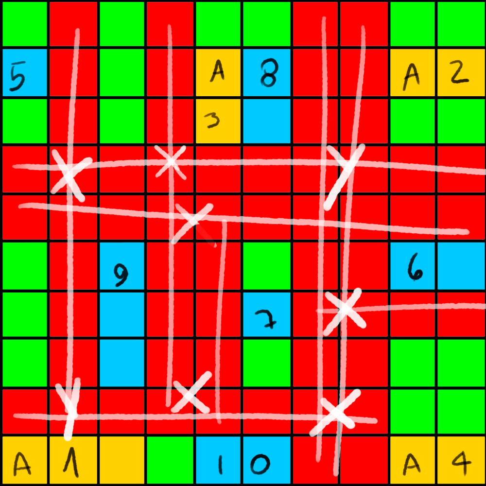

The matrix used in the Script was created based on the following sketch:

## Def divideId
The ID of a space is composed of a UUID, followed by the thickness/weight of the road
(if it is a road) or -1 when it is an empty space, followed by a road id/name 
or a building/warehouse id, finally followed by the name of the other road if it is a
crossing road.

### Examples: 

#### _Empty space:_
`550e8400-e29b-41d4-a716-446655440000_-1`

#### _Road with thickness 1 (Narrow):_
`550e8400-e29b-41d4-a716-446655440000_0_4`

#### _Road with thickness 2 (Wide):_
`550e8400-e29b-41d4-a716-446655440000_00_4`

#### _Road intersections with thickness 1 (Narrow):_
`550e8400-e29b-41d4-a716-446655440000_0_4_2`

#### _Road intersections with thickness 2 (Wide):_
`550e8400-e29b-41d4-a716-446655440000_00_4_2`

#### _Building:_
`550e8400-e29b-41d4-a716-446655440000_5`

#### _Warehouse:_
`550e8400-e29b-41d4-a716-446655440000_a3`

Note that the ID of a space contains all this information separated by “_”, 
so this function simply divides each of these pieces of information and stores them
individually in an array, returning this array.

## Def isCrossroad
This function checks the 4 possible spaces in the diagonal of a road-type element
to be processed. If there are 2 road-type diagonals with the same id/name, 
the function returns an intersection of the road thickness change type.
If there are 3 road-type diagonals, 2 with the same id/name and 1 having the same id/name
as the processed element, then the function returns an intersection 
of the same thickness type. Otherwise, it returns nothing.

## Def nextStepOnTheRoad
Considering that the initial script processing will scan each element of a matrix, 
this element being considered a space. This is a recursive function, 
which initially identifies the first space of the building or warehouse type 
and then, from there, searches for the next space in an orthogonal line 
that is of the road type. From there, the function enters recursion, 
calling itself, always searching for the next space of the road type 
in an orthogonal line until it finds at some point within this line a building
or warehouse. During the recursion, between the first space of the building 
or warehouse type and the last, the road intersections are saved. 
Therefore, at the end of the recursion, the building or warehouse identified
initially, the intersections and the building or warehouse identified
at the end are then returned as nodes of the graph.